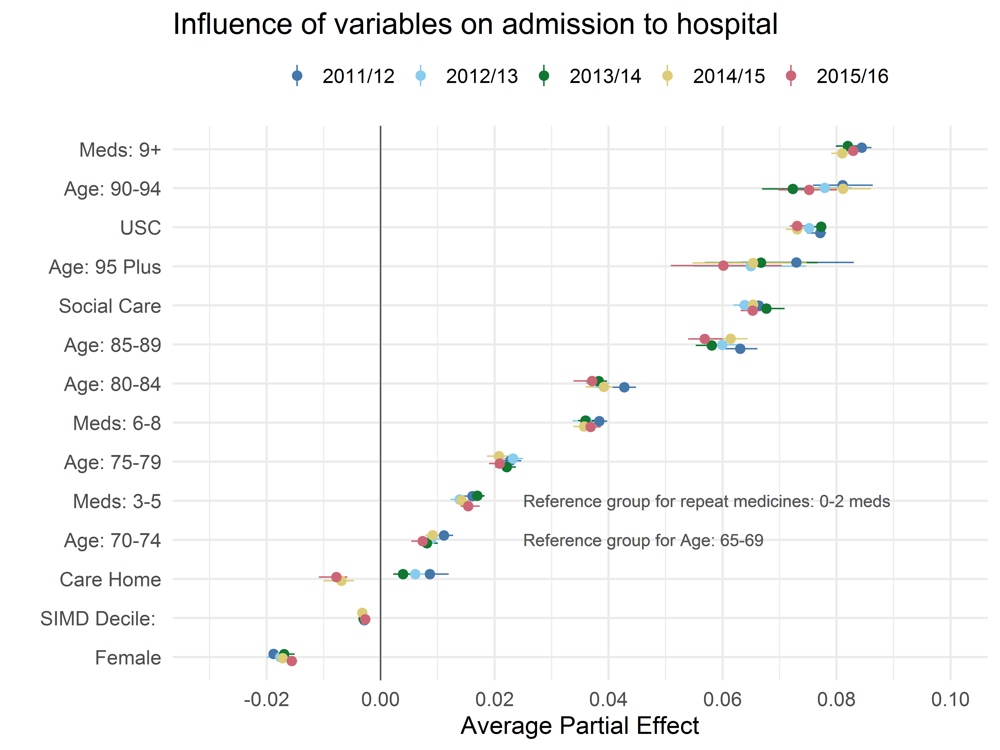
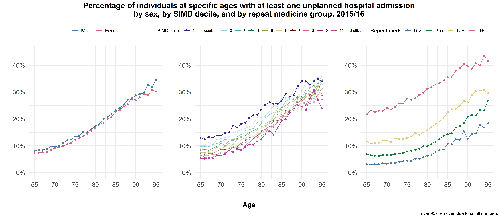
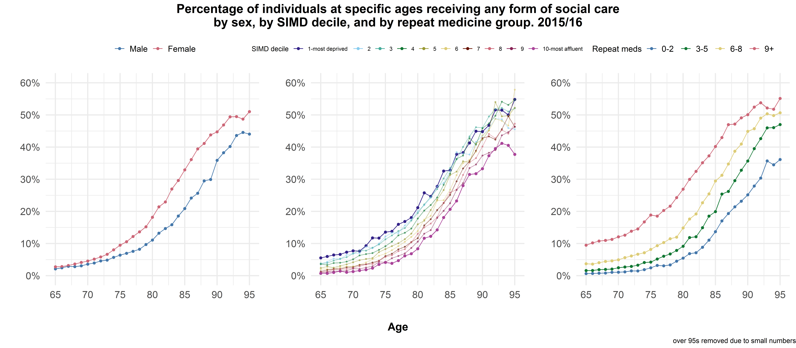
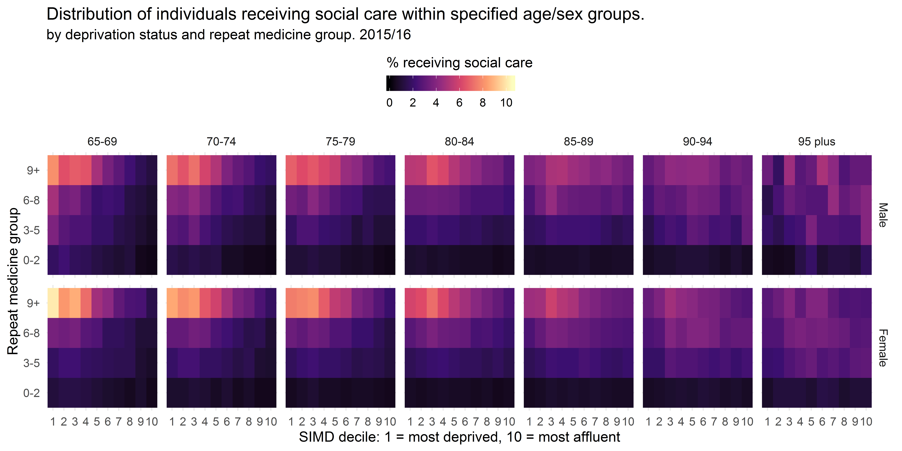
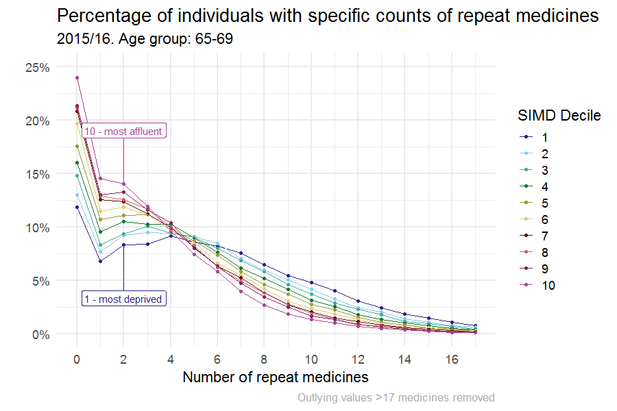

```{r setup, include=FALSE}
options(htmltools.dir.version = FALSE)
knitr::opts_chunk$set(echo = FALSE, eval = TRUE)
```


class: inverse, center, middle

background-image: url(images/IMG_0280.jpg)
background-size: cover


# Multimorbidity and social care

##Key findings

.large[David Henderson | SCADR brief | 18/07/2019]

<br><br>


---

# Background


* Multimorbidity (two or more long-term conditions) is increasing in prevalence and is associated with many negative health outcomes

--

* Also associated with higher health care use

--

* Very little research has been conducted into the effects of multimorbidity on **social care** use

--

* Intuitive that there is a link, but never shown empirically

--

* Important in context of health and social care integration. Government aware of issues arising from ageing population. Aim to improve services and reduced hospital admissions. 

--

* Not going to discuss process in detail today, but talk about main findings


---

###People receving social care are more likely to to have an unplanned hospital admission

```{r, eval=TRUE, out.width="700px"}

```


---

###Other factors affecting unplanned hospital admissions

```{r, eval=TRUE, out.width="1200px", dpi=600}

```

--

* Need to do some survival modelling to confirm, but why are social care users more likely to have an unplanned admission?

---

###Probably driven by fact social care users are sick

```{r, eval=TRUE, out.width="1200px", dpi=600}

```

--

* Large reductions in absolute and particularly *relative* numbers of home care users.

---

###Higher rates of social care in more deprived areas driven by the very sick

```{r, eval=TRUE, out.width="850px"}

```

* We are currently concluding that service provision seems "fair" in that higher receipt in more deprived areas, **but** we can't accurately measure **need**
---

###Effect of deprivation on multimorbidity reduces with age 

```{r, eval=TRUE, out.width="900px"}

```

---

#Conclusions

<br><br>

- Social care users have higher probability of unplanned hospital admission

<br>

- Any reductions in rate of unplanned admissions unlikley (under current models) to come from social care sector

---
#Conclusions

<br><br>

- Multimorbidity is associated with higher social care use

<br>

- This is often overlooked in MM and policy literature

---
#Conclusions

<br><br>

- Receipt of social care is higher in more deprived areas

<br>

- May not reflect need, more analysis required

<br>

- However, no evidence of an "inverse social care law" at present

