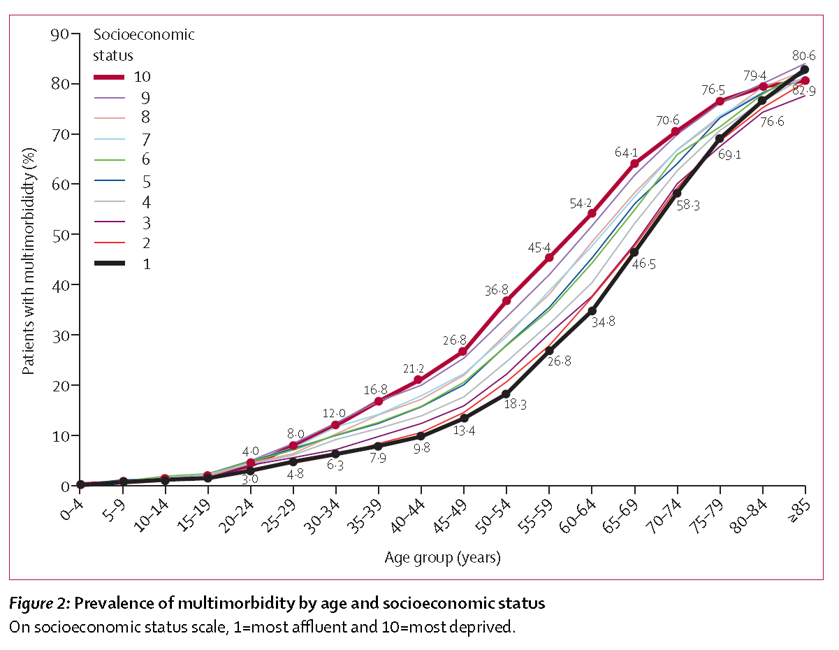

```{r setup, include=FALSE}
knitr::opts_chunk$set(echo = FALSE)
```

## Introduction

- Personal Background
- Project funding and supervision
- Project outline
- Progress

## Personal Background


## {.smaller}


[link to story]<http://www.thedailymash.co.uk/news/science-technology/people-doing-phds-admit-its-just-an-excuse-to-fanny-about-20170926136446>

##Project funding and supervision

> - Scottish Government
> - ESRC
> - UBDC
> - Nick Bailey, Colin McCowan, Stewart Mercer

##Project outline
### Background (a) Multimorbidity

